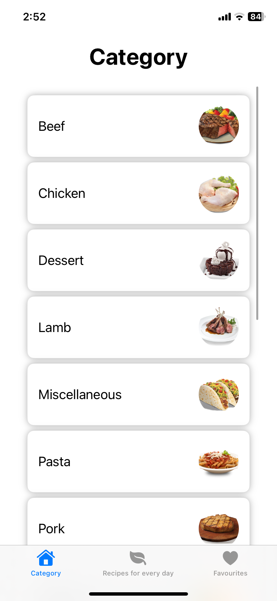

# Book recipe
Book recipe with category and random recipes for iOS

### Main page
Main page have 10+ category recipes.  
Each category has at least 10 recipes:

### Category
Each category has a short history written:

### Step by step recipe
Most recipes have step-by-step instructions.

### Random recipe
Random recipe for every day.
This section changes once a day 

### Favorite recipe
Your favorite recipe saves in your phone

### In version 1.1:
Updated all view, added favorite section and random section recipes are updated once a day

AppIcon added and icons changed